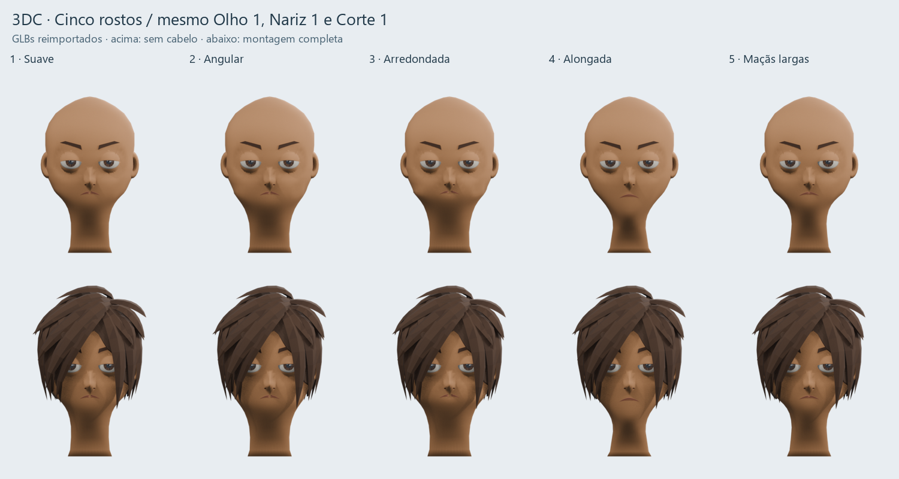

# 3DC Lab — v1 · Personagens do Real Car Lifestyle

O **3DC Lab v1** é o laboratório de personagens do jogo 3D **Real Car Lifestyle (RCL)**: permite estudar módulos, montar combinações e gerar GLBs, enquanto registra referências, decisões, código, resultados e limitações em Markdown e commits. Esses conceitos e arquivos serão usados no projeto do jogo. O laboratório também orienta o futuro menu de criação e a produção dos 50 personagens e 200 NPCs previstos na visão do projeto.

**Estamos na v1 do produto.** As pastas `conjunto-feminino-v1` e `conjunto-feminino-v2` são revisões dos **modelos**, ambas dentro do 3DC Lab v1. A versão `0.1.0` do pacote é a identificação técnica do protótipo; não afirma uma entrega de produção final. O catálogo ativo é a revisão de modelos `rcl-female-v2`.

| Para acompanhar | Documento |
| --- | --- |
| Como os modelos e o seletor foram construídos | [Processo do 3DC Lab v1](docs/PROCESSO_3DC_LAB_V1.md) |
| Quais GLBs levar para o jogo e o que ainda validar | [Entrega ao projeto do jogo](docs/ENTREGA_GLB_JOGO.md) |
| O que aconteceu nesta etapa, decisões e problemas | [Registro de 17/09/2026](docs/registros/2026-09-17-conjunto-feminino.md) |
| Resumo das mudanças | [Changelog](CHANGELOG.md) |
| Referências visuais que sustentam os módulos | [100 originais e índice](docs/referencias-rcl/originais/README.md) |

O Git registra o processo; o seletor gera o GLB. A v1 não captura automaticamente sessões, screenshots ou histórico de decisões: esses registros são mantidos junto de cada entrega no repositório.

A visão, o escopo inicial e as etapas futuras estão em [Visão do 3DC para Real Car Lifestyle](VISAO_3DC_REAL_CAR_LIFESTYLE.md).

## Implementação atual — cinco bases com rosto montado

A versão atual inclui cinco bases femininas, **Cortes Femininos 1 a 12**, par de Olho 1 e Nariz 1 em GLBs separados. Trocar rosto mantém o cabelo escolhido; trocar cabelo mantém rosto, olhos e nariz. Sobrancelhas, boca e orelhas acompanham o GLB de cada base. A criação de geometria dentro do aplicativo e o randomizador ainda não estão implementados.

Arquivos incluídos: `public/models/rcl-feminino-v2/`. Cena Blender, comparação e validações versionadas: [revisão de modelos 2](artifacts/conjunto-feminino-v2/ENTREGA.md). A primeira revisão e os pilotos anteriores foram preservados.



Os cabelos novos têm [comparação com as referências e checkpoints por corte](artifacts/cabelos-femininos-v1/README.md). O [registro da expansão](docs/registros/2026-09-17-cabelos-femininos.md) explica modelagem, correções de encaixe e limites da primeira versão. O fluxo de exportação do aplicativo foi preservado.

Nesta etapa, quatro slots:

| Slot | Conteúdo |
| --- | --- |
| **Base feminina** | cinco formas, pescoço, sobrancelhas, boca e orelhas |
| **Cabelo** | 12 cortes femininos, cada um em GLB independente |
| **Olhos** | Olho 1, par com pálpebras e transição de pele |
| **Nariz** | Nariz 1, com borda de contato comum |

Conjunto estático: sem editor de proporções, animação, morph targets ou blendshapes.
Sem ajuste de posição/rotação/escala — o encaixe vem do Blender.

---

## Como rodar

```powershell
npm ci
npm run dev
```

URL local: **http://localhost:5173/**

| Comando | O que faz |
| --- | --- |
| `npm run typecheck` | `tsc --noEmit` |
| `npm run build` | typecheck + build de produção em `dist/` |
| `npm run preview` | serve o `dist/` |
| `npm run validate:glb -- <arquivo.glb>` | roda o **Khronos glTF Validator** no arquivo |
| `npm run test:rcl` | testa cinco trocas, cabelo/olhos/nariz fixos e exportação/reimportação usando o código real do app, sem automação da interface |
| `npm run test:rcl-hair` | testa as 60 combinações e as trocas nos dois sentidos, preservando módulos e partes fixas; sem navegador/WebGL |

Página auxiliar (só no `npm run dev`): **http://localhost:5173/verify.html** abre um `.glb`
em cena limpa, sem a biblioteca, e mostra malhas, triângulos, materiais e caixa envolvente.

---

## Como experimentar o conjunto e importar outras peças

1. Abra a URL local: cinco bases, 12 cortes, Olho 1 e Nariz 1 aparecem automaticamente. A escolha da revisão 1 dos modelos migra para a mesma variante da revisão 2.
2. Use **◀ ▶**, as **setas do teclado** ou os nomes para trocar a base; cabelo, olhos e nariz permanecem montados e imóveis. Escolha outro corte na lista de cabelos para trocar somente esse módulo.
3. **Frente**, **Perfil**, **Três quartos** e **Costas** mudam apenas a câmera. **Ocultar cabelo** afeta somente a visualização.
4. **Exportar montagem GLB** grava os quatro slots, inclusive o cabelo oculto na prévia. O botão aguarda o término do carregamento das peças.
5. Para experimentar outros arquivos, arraste os GLBs aos respectivos slots. Suas importações continuam armazenadas no navegador; as peças incluídas no projeto não têm botão de remoção.

A ordem do ◀ ▶ segue o nome do arquivo com ordenação numérica ("base 2" antes de "base 10").
A base escolhida é lembrada ao recarregar a página.

---

## Versões fixadas

Dependências pinadas (sem `^`), com `package-lock.json` versionado.

| Pacote | Versão |
| --- | --- |
| three | 0.186.0 |
| @types/three | 0.186.0 |
| react / react-dom | 19.3.0 |
| vite | 8.3.0 |
| @vitejs/plugin-react | 6.1.1 |
| typescript | 5.9.3 |
| idb | 8.0.3 |
| gltf-validator (dev) | 2.0.0-dev.3.10 |

`GLTFLoader` e `GLTFExporter` vêm do próprio pacote `three`, então loader, exporter e core
são sempre a mesma versão.

---

## Armazenamento

Peças e seleção ficam em **IndexedDB** (banco `montador-3dc`, versão 2), neste navegador e
neste computador. Os binários ficam em um store separado (`blobs`), então listar a biblioteca
não desserializa ArrayBuffers. Nada de modelo vai para `localStorage`; não há backend.

Limpar os dados do site apaga a biblioteca — seus arquivos do Blender continuam sendo a cópia
de segurança. Em *Armazenamento* há uso/cota e o botão para pedir persistência ao navegador.

A versão 2 do banco migra bases de dados antigas: remove as categorias editáveis, os transforms
por slot e qualquer peça que não seja base nem cabelo.

---

## Decisões de comportamento

- **Nada é normalizado.** Sem centralização, sem normalização de escala, sem união de malhas.
- **Trocas rápidas.** Cada slot tem um contador monotônico; toda etapa assíncrona confere se
  ainda é a seleção corrente, então uma base antiga que termine de carregar depois é descartada.
- **Recursos compartilhados.** Cada arquivo é parseado uma vez e guardado em cache; cada uso é
  um clone que compartilha geometrias, materiais e texturas. Trocar de base só desanexa o objeto;
  `dispose()` acontece apenas quando a peça é removida da biblioteca.
- **Importação validada.** Todo arquivo passa por conferência do container GLB e por um parse
  completo antes de entrar; arquivo inválido não é gravado e o motivo aparece na tela.
- **Exportação.** O grupo do personagem é movido para uma `Scene` temporária, então grade, luzes
  e câmera nunca entram no `.glb`. O resultado é conferido byte a byte (magic `glTF`, versão 2,
  tamanho declarado) antes de virar download — não há JSON renomeado para `.glb`.

---

## Limitações verificadas desta versão

Lidas no código do `GLTFExporter`/`GLTFLoader` do three 0.186.0 instalado. As mesmas notas
aparecem no diálogo de exportação.

- **Animação não faz parte desta versão.** Clipes presentes nos arquivos não são tocados nem
  exportados; se houver algum, o relatório avisa antes de exportar.
- **Materiais.** Só `MeshStandardMaterial` / `MeshPhysicalMaterial` / `MeshBasicMaterial` têm
  correspondência direta em glTF; outros são aproximados e `ShaderMaterial` é ignorado.
- **Texturas.** Reescritas via `canvas`. Comprimidas (KTX2/Basis, DDS) fazem o exporter lançar
  *"Invalid image type"* e `DataTexture` só é aceita em RGBA — esses casos são bloqueados antes.
- **Skinning.** `SkinnedMesh` só exporta certo com o esqueleto dentro do grafo exportado.
- **Morph targets.** Apenas `POSITION` e `NORMAL`.
- **Objetos ocultos** não são exportados (`onlyVisible: true`).
- **Resolução de textura** não é reduzida, então o `.glb` pode ficar grande.
- **Nomes** podem ganhar sufixo para ficarem únicos (`Personagem` → `Personagem_1`).
- **Compatibilidade com Unity não foi testada** e portanto não é afirmada.

---

## Verificações do conjunto atual

- Build TypeScript/Vite aprovado; aviso de tamanho do bundle JavaScript permanece.
- Cinco trocas usando `SceneManager` e `GLTFExporter` reais mantêm as mesmas instâncias de cabelo, Olho 1 e Nariz 1. Cada exportação é reimportada para comparar geometria e materiais.
- Dez reimportações no Blender conferem os módulos separados e as cinco montagens. Bordas de pele coincidem; o cabelo mantém o mesmo arquivo da revisão anterior; nenhum cruzamento base/cabelo foi detectado nesses testes.
- Os 18 GLBs conferidos (oito módulos, cinco montagens do Blender e cinco exportações do app) passaram sem erros ou avisos no Khronos Validator. [Resultado registrado](artifacts/conjunto-feminino-v2/khronos-final.txt).
- A interface atual com quatro slots não recebeu uma nova auditoria por cliques. A importação em uma engine de jogo ainda precisa ser testada.

## Histórico — verificação anterior no navegador

Com 3 bases + 1 cabelo importados (usando um `.glb` válido como arquivo de teste):

- ◀ ▶ e as setas do teclado percorrem as bases nos dois sentidos, com volta no fim da lista,
  e o slot de cabelo permanece montado e selecionado.
- Recarregar a página restaura a base escolhida e o cabelo.
- O relatório de exportação mostra exatamente as duas peças montadas.
- `npm run build` conclui sem erro de TypeScript.
- Validação de arquivo: `npm run validate:glb -- artifacts/personagem-fixtures.glb` reportou
  0 erros e 0 avisos no Khronos glTF Validator, sem recursos externos.

Esse ensaio anterior usou fixtures e dois slots. Não equivale à validação visual do catálogo atual nem a um teste no jogo. O estado atual está na seção acima.
