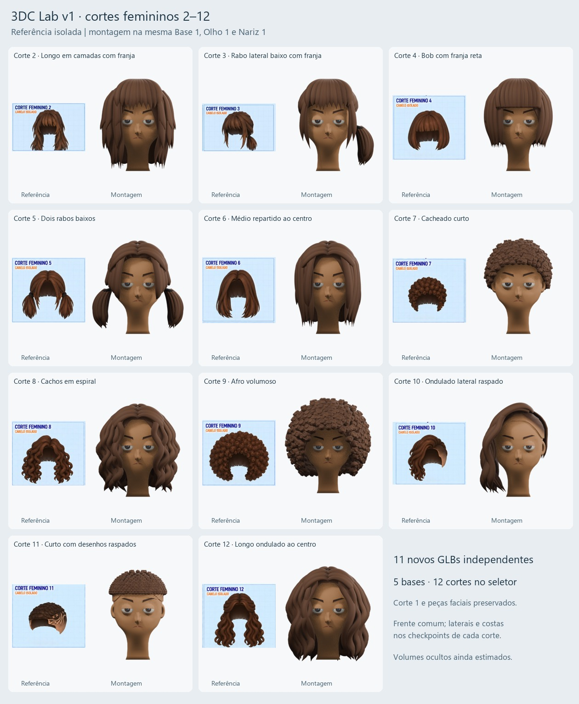

# Cortes femininos 2–12

Entrega do **3DC Lab v1**, compatível com `rcl-female-v2`. O seletor oferece 12 cortes e cinco bases; Corte 1 e todos os módulos faciais anteriores foram preservados. O exportador do aplicativo não foi alterado.



Cada pasta `corte-NN` contém:

- `corte-feminino-NN.blend`: cena de trabalho com as cinco bases existentes, peças faciais e novo cabelo; Base 1 visível inicialmente.
- `corte-feminino-NN.glb`: somente o módulo de cabelo, no referencial comum.
- `progresso.json`: parâmetros, referências e resultados da reimportação/encaixe.
- `frente.png`, `perfil.png`, `tres-quartos.png`, `costas.png`, `isolado.png`: prévias leves da geometria que originou o GLB.

Os mesmos GLBs estão em `public/models/rcl-feminino-v2/`; o manifesto mantém os IDs antigos. [Teste das 60 combinações](teste-seletor.json), [validação Khronos](khronos.txt), [hashes e catálogo](catalogo.json), [perfis e costas](conferencia-perfil-costas.jpg), [decisões e problemas encontrados](../../docs/registros/2026-09-17-cabelos-femininos.md).

## Retomar um corte

Para editar manualmente, abra o `.blend` do corte e use os grupos de vértices nomeados. Para regenerar por parâmetros, altere somente o corte desejado em `scripts/rcl-cabelos.py`. Os comandos abaixo sobrescrevem o checkpoint daquele corte; conserve uma revisão nomeada se quiser comparar uma nova tentativa.

```powershell
$blenderExe = 'C:\Program Files\Blender Foundation\Blender 5.2\blender.exe'
# Prévia: salva a cena antes de renderizar; não publica no catálogo.
& $blenderExe --factory-startup -b -t 2 --python-exit-code 1 --python scripts/rcl-cabelos.py -- --cut 6
# Após revisar a forma: exporta, reimporta e verifica nas cinco bases.
& $blenderExe --factory-startup -b -t 2 --python-exit-code 1 --python scripts/rcl-cabelos.py -- --cut 6 --deliver
# Publica somente se os onze checkpoints estiverem validados.
python scripts/rcl-cabelos-catalogo.py
npm run test:rcl-hair
```

Um processo Blender por vez, com `--factory-startup` e duas threads, evita carregar complementos e cenas históricas desnecessárias. Não é preciso regenerar cortes concluídos para retomar outro. Um checkpoint `needs_clearance_fix` não é copiado para a biblioteca pública; a versão pública anterior permanece até a correção passar.

Limites: cabelos estáticos, traseiras estimadas, algumas mechas/cachos ainda mais regulares que as referências. Raspados usam cores de vértices. Os cortes cacheados são densos e precisam de otimização conforme o orçamento do jogo. A verificação do aplicativo usa seu montador real sem navegador; não representa uma auditoria por cliques.
